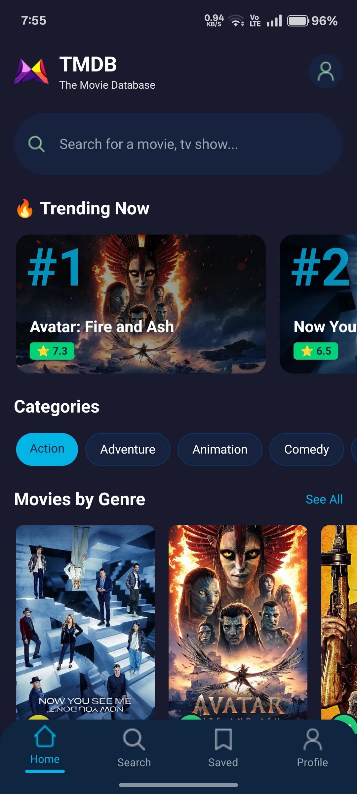
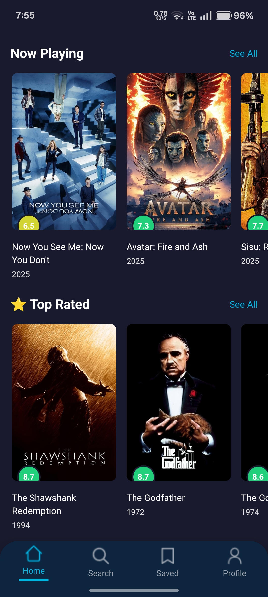
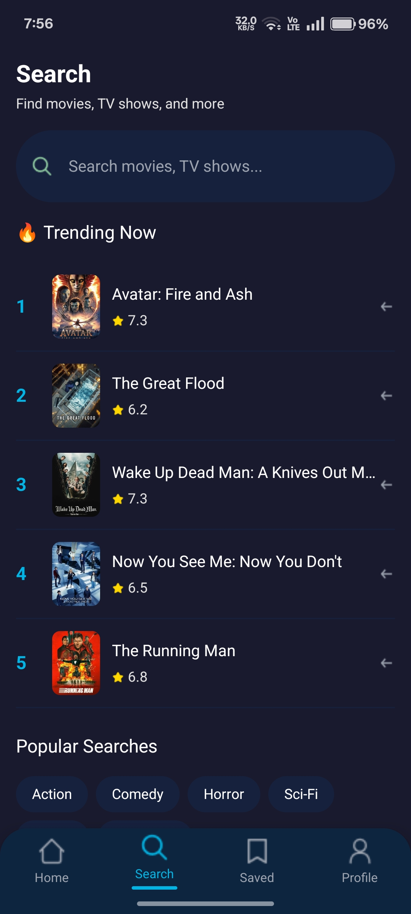
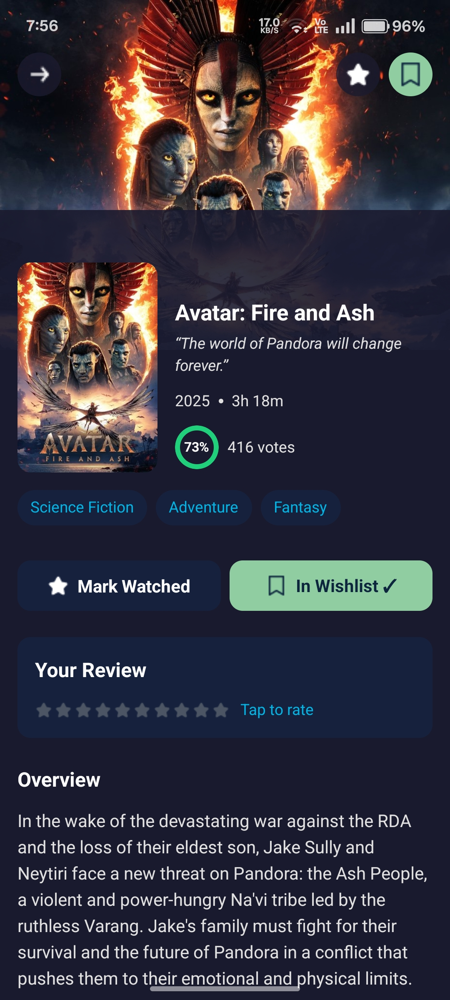
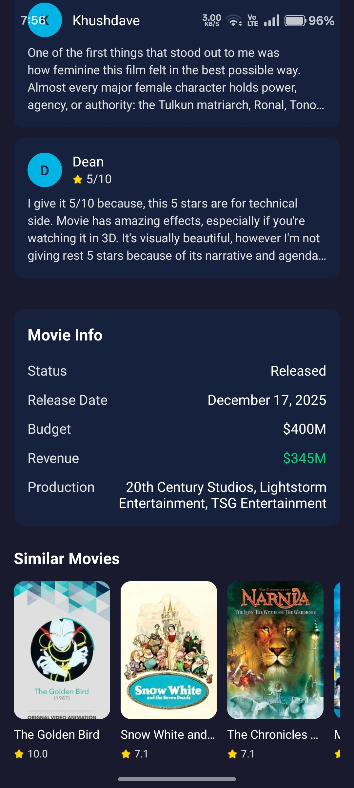
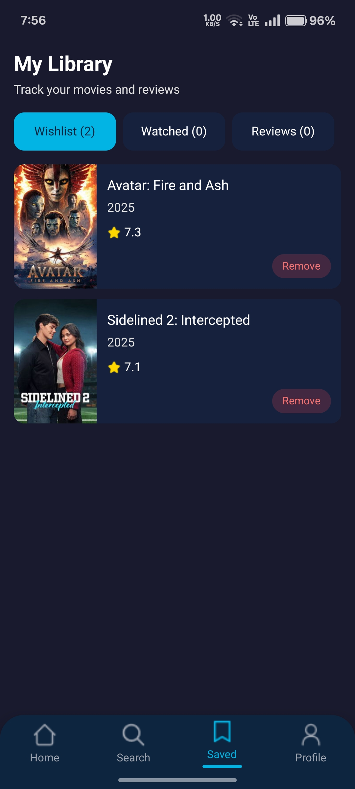
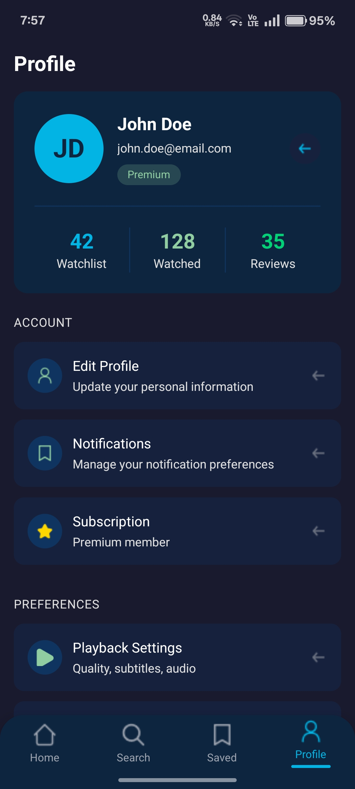

<div align="center">
  
# 🎬 CineVerse - Movie Discovery App


<br />
<br />

<p align="center">
  <strong>🚀 A beautifully crafted mobile movie discovery application built with React Native & Expo</strong>
</p>

<p align="center">
  Explore trending movies • Search your favorites • Build your watchlist • Rate & review films
</p>

<br />

[](https://github.com/dinraj910/Mobile-Movie-App---React-Native)
[](https://github.com/dinraj910/Mobile-Movie-App---React-Native)
[](https://github.com/dinraj910/Mobile-Movie-App---React-Native/issues)
[](LICENSE)

</div>

---

## 📱 Screenshots

<div align="center">
  <table>
    <tr>
      <td></td>
      <td></td>
      <td></td>
      <td></td>
    </tr>
    <tr>
      <td align="center"><b>🏠 Home</b></td>
      <td align="center"><b>🎬 Details</b></td>
      <td align="center"><b>🔍 Search</b></td>
      <td align="center"><b>💾 Saved</b></td>
    </tr>
    <tr>
      <td></td>
      <td></td>
      <td></td>
      <td></td>
    </tr>
    <tr>
      <td align="center"><b>👤 Profile</b></td>
      <td align="center"><b>⭐ Reviews</b></td>
      <td align="center"><b>🎯 More</b></td>
      <td></td>
    </tr>
  </table>
</div>

---

## ✨ Features

<div align="center">

| Feature | Description |
|---------|-------------|
| 🔥 **Trending Movies** | Discover what's hot right now with real-time trending data |
| 🔍 **Smart Search** | Search millions of movies with instant results |
| 📋 **Wishlist** | Save movies you want to watch later |
| ✅ **Watched List** | Track movies you've already seen |
| ⭐ **User Reviews** | Rate movies (1-10) and write personal reviews |
| 🎭 **Genre Filtering** | Browse movies by your favorite genres |
| 📊 **Detailed Info** | View cast, crew, budget, revenue & more |
| 🎨 **Beautiful UI** | Modern, dark-themed interface inspired by TMDB |
| 📱 **Responsive** | Optimized for all screen sizes |
| 💾 **Offline Storage** | Your data persists locally |

</div>

---

## 🛠️ Tech Stack

<div align="center">

### Core Technologies

| Technology | Purpose |
|------------|---------|
|  | Cross-platform mobile development |
|  | Development framework & tooling |
|  | Type-safe JavaScript |
|  | File-based navigation |

### Styling & UI

| Technology | Purpose |
|------------|---------|
|  | Tailwind CSS for React Native |
|  | Utility-first CSS framework |

### Data & APIs

| Technology | Purpose |
|------------|---------|
|  | Movie database API |
|  | Local data persistence |

</div>

---

## 🚀 Getting Started

### Prerequisites

Before you begin, ensure you have the following installed:

- **Node.js** (v18 or higher)
- **npm** or **yarn**
- **Expo CLI** (`npm install -g expo-cli`)
- **Expo Go** app on your mobile device

### Installation

```bash
# Clone the repository
git clone https://github.com/dinraj910/Mobile-Movie-App---React-Native.git

# Navigate to project directory
cd Mobile-Movie-App---React-Native

# Install dependencies
npm install

# Start the development server
npx expo start
```

### 🔑 API Configuration

1. Get your free API key from [TMDB](https://www.themoviedb.org/settings/api)
2. Open `services/api.config.ts`
3. Replace the API key with your own:

```typescript
export const TMDB_CONFIG = {
  API_KEY: 'YOUR_API_KEY_HERE',
  // ...
};
```

---

## 📁 Project Structure

```
📦 mobile_movie_app
├── 📂 app                    # Screens & Navigation
│   ├── 📂 (tabs)             # Tab-based navigation
│   │   ├── 📄 index.tsx      # Home screen
│   │   ├── 📄 search.tsx     # Search screen
│   │   ├── 📄 saved.tsx      # Wishlist/Watched/Reviews
│   │   ├── 📄 profile.tsx    # User profile
│   │   └── 📄 _layout.tsx    # Tab bar configuration
│   ├── 📂 movies
│   │   └── 📄 [id].tsx       # Movie details (dynamic route)
│   └── 📄 _layout.tsx        # Root layout
├── 📂 components             # Reusable UI components
│   ├── 📄 MovieCard.tsx
│   ├── 📄 SearchBar.tsx
│   ├── 📄 TrendingCard.tsx
│   ├── 📄 SectionHeader.tsx
│   ├── 📄 GenreChip.tsx
│   └── 📄 RatingCircle.tsx
├── 📂 services               # API & Storage services
│   ├── 📄 api.config.ts      # TMDB configuration
│   ├── 📄 tmdb.ts            # API functions
│   ├── 📄 storage.ts         # AsyncStorage handlers
│   └── 📄 index.ts           # Service exports
├── 📂 constants              # Icons & images
├── 📂 interfaces             # TypeScript interfaces
├── 📂 assets                 # Static assets
└── 📄 tailwind.config.js     # TailwindCSS configuration
```

---

## 🎨 Design System

### Color Palette

<div align="center">

| Color | Hex | Usage |
|-------|-----|-------|
|  Primary | `#01B4E4` | Main brand color, CTAs |
|  Secondary | `#90CEA1` | Success states, wishlist |
|  Accent | `#01D277` | Watched status, highlights |
|  Dark Primary | `#0D253F` | Navigation, headers |
|  Dark BG | `#1A1A2E` | Main background |
|  Dark Card | `#16213E` | Card backgrounds |

</div>

---

## 📊 API Endpoints Used

```
GET /trending/movie/{time_window}     # Trending movies
GET /movie/popular                     # Popular movies
GET /movie/now_playing                 # Now playing
GET /movie/top_rated                   # Top rated movies
GET /movie/upcoming                    # Upcoming movies
GET /movie/{movie_id}                  # Movie details
GET /movie/{movie_id}/credits          # Cast & crew
GET /movie/{movie_id}/similar          # Similar movies
GET /movie/{movie_id}/reviews          # User reviews
GET /search/movie                      # Search movies
GET /genre/movie/list                  # Genre list
GET /discover/movie                    # Discover by genre
```

---

## 🔧 Key Features Implementation

### 🎯 File-based Routing
Using Expo Router for seamless navigation with file-based routing system.

### 💾 Local Storage
AsyncStorage implementation for:
- Wishlist persistence
- Watched movies tracking
- User reviews storage

### 🎨 Responsive Design
NativeWind (TailwindCSS) for consistent styling across devices.

### ⚡ Performance Optimized
- Lazy loading for images
- Pagination for search results
- Efficient state management

---

## 🤝 Contributing

Contributions are welcome! Here's how you can help:

1. **Fork** the repository
2. **Create** a feature branch (`git checkout -b feature/AmazingFeature`)
3. **Commit** your changes (`git commit -m 'Add AmazingFeature'`)
4. **Push** to the branch (`git push origin feature/AmazingFeature`)
5. **Open** a Pull Request

---

## 📄 License

This project is licensed under the **MIT License** - see the [LICENSE](LICENSE) file for details.

---

## 🙏 Acknowledgments

- [TMDB](https://www.themoviedb.org/) for the amazing movie database API
- [Expo](https://expo.dev/) for the incredible development framework
- [NativeWind](https://www.nativewind.dev/) for TailwindCSS in React Native

---

<div align="center">

### 💖 If you found this project helpful, please give it a ⭐!

<br />

**Built with ❤️ by [Dinraj](https://github.com/dinraj910)**

<br />

[](https://linkedin.com/in/dinraj910)
[](https://github.com/dinraj910)
[](https://dinraj910.github.io)

</div>

---

<div align="center">
  <sub>🎬 CineVerse - Your Gateway to Cinema</sub>
</div>
